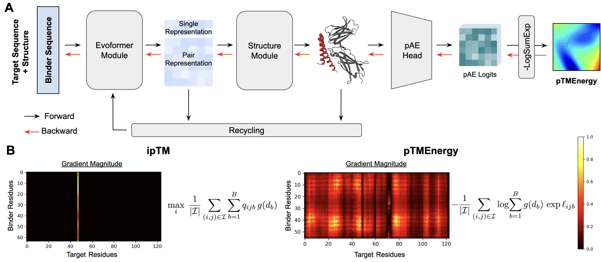
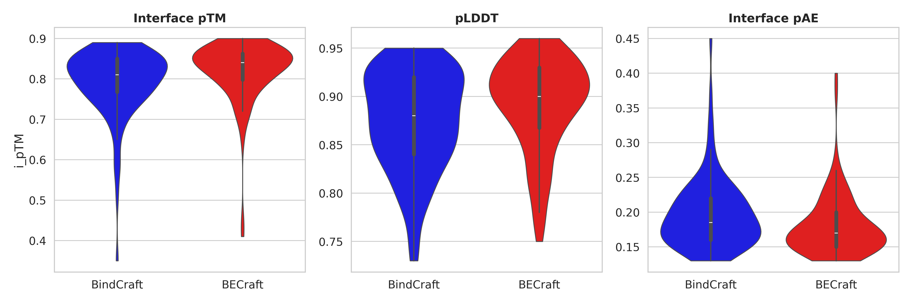

# BECraft

**BECraft** (BindEnergyCraft) is a drop-in extension of the protein–binder design pipeline first introduced in BindCraft (Pacesa et al., 2024). By adding an energy-based loss to the original AlphaFold2-back-propagation workflow, we improve binder designs while maintaining the user-friendly pipeline of BindCraft!



[Preprint link for BECraft](https://arxiv.org/abs/2505.21241)

## Installation

After cloning this repository, navigate to the ```becraft``` folder and run the BindCraft installation script:

`bash install_bindcraft.sh --cuda '12.4' --pkg_manager 'conda'`

Like BindCraft, BECraft requires a CUDA-compatible Nvidia graphics card to run. In the *cuda* setting, please specify the CUDA version compatible with your graphics card, for example '11.8'. If unsure, leave blank but it's possible that the installation might select the wrong version, which will lead to errors. In *pkg_manager* specify whether you are using 'mamba' or 'conda', if left blank it will use 'conda' by default. Note: This install script will install PyRosetta, which requires a license for commercial purposes. The code requires about 2 Mb of storage space, while the AlphaFold2 weights take up about 5.3 Gb.

Next, navigate to the ```ColabDesign``` directory and run ```pip install -e .```  to install the ptmenergy loss function.

## Running binder design

To run binder design, activate the newly created ```BindCraft``` environment and navigate to the ```becraft``` directory. Then, execute the following command:

```
python -u ./bindcraft.py --settings './settings_target/PDL1.json' --filters './settings_filters/no_filters.json' --advanced './settings_advanced/default_4stage_multimer.json'
```

Importantly, in the default configuration provided in ```default_4stage_multimer.json```, the iptmenergy loss has a weight of 1, and the iptm loss has a weight of 0. To use other design configuration jsons, similarly add the iptmenergy field. By default, MPNN optimization is disabled. Please set this to True if necessary.

For further information on all design and filter settings, see the [Bindcraft documentation](becraft/README.md).

## Example design comparison for PDL1

In ```becraft/example```, we provide a comparison of 100 designs generated using:
- BindCraft: optimizing ipTM with weight of 1
- BECraft: optimizing interface pTMEnergy with weight of 1
All other parameters are identical for fair comparison.



Binder design outcomes are highly target-dependent. While BECraft generally improves performance, it is not universally superior. Notably, increasing the weight of the energy-based loss (from the default 0.05 in BindCraft to a higher value like 1.0) often yields better results, even when compared to increasing the ipTM loss to the same weight under otherwise identical settings.

## Tuning the effect of TM-weighting

As described in our preprint, the pTMEnergy term in BECraft incorporates a weighting scheme derived from the predicted TM-score (pTM) formulation. Specifically, the contribution of each predicted alignment error bin is scaled by a function $g(d_b)$ that up-weights smaller errors, reflecting the importance of accurate local packing for protein stability and inter-chain interactions. This design choice aims to guide the binder generation process towards structures with well-defined interfaces. 

However, we sometimes observe that an overly strong emphasis on this local packing, as enforced by the default TM-weighting, can hinder the exploration of other crucial aspects of binder design. In such cases, downweighting or even disabling the TM-weighting might be beneficial.

To address this potential trade-off, BECraft provides the `iptmenergy_lambda` parameter within the advanced settings JSON file. This parameter serves as a scaling factor for the pTMEnergy loss:

-   Setting `lambda` to `1` (the default value) applies the full calculated pTMEnergy during the design process. This is generally recommended as a starting point to encourage well-packed interfaces.

-   Setting `lambda` to `0` completely disables TM-weighting. This results in an energy score that is simply the -LogSumExp over pAE logits, averaged over interface residue pairs.

It is recommended to experiment with different values to determine the optimal balance for a given design problem.
